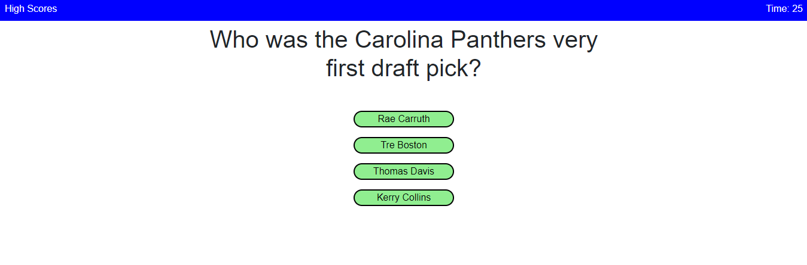
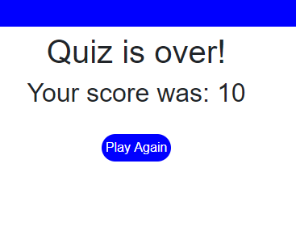

# PANTHERS QUIZ
****

# Deployed Application
****
https://graysondeese.github.io/PanthersQuiz/
****

# About
****

The player has 30 seconds to answer as many questions as they can. Getting a question right adds one to the players score. Getting a question wrong removes 5 seconds from the timer. Everything is created with JavaScript, HTML & CSS.

****

# Screenshots
****

****

****

